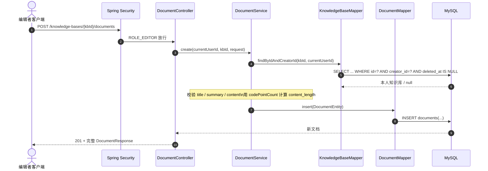
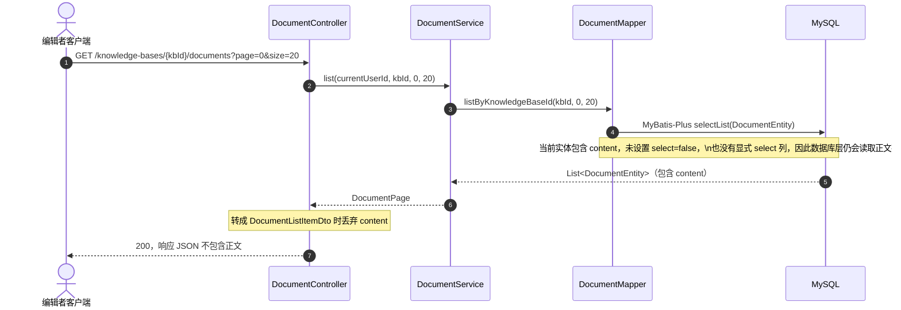
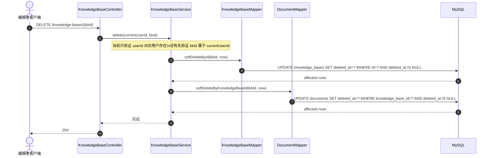

# 里程碑 04：知识库与文档管理（当前实现、性能边界与安全/事务缺口）

本篇记录知识库（上层容器）与文档（底层内容）的当前实现，并把“已经由代码/测试证明的事实”和“设计目标、通用原理、待验证项”分开。

本里程碑最值得学习的不是 CRUD 本身，而是三个容易被接口表象掩盖的工程问题：

1. **HTTP 响应没有正文，不等于数据库查询没有读取正文。**
2. **先校验父资源归属，不等于后续按子资源 ID 写入就天然安全。**
3. **应用层连续执行两个软删除 UPDATE，不等于它们已经具备事务原子性。**

> 审阅基准：以下“项目事实”以 2026-09-05 仓库中的 Java、Flyway SQL、测试代码与现有 Surefire 报告为准。MySQL 执行计划、真实大文本 I/O 和事务故障恢复尚未做专项实测的地方，统一标为“待验证”。

---

## 1. 当前落地范围与完成度

对应需求：[一阶段需求文档.md](../../一阶段需求文档.md) 第 3 节与 [phase-1-api.md](../api/phase-1-api.md)。

| 能力 | 当前状态 | 证据 / 边界 |
| :--- | :--- | :--- |
| 知识库 CRUD | ✅ 已实现 | `KnowledgeBaseController` / `KnowledgeBaseService` / `KnowledgeBaseMapper` |
| 文档 CRUD | ✅ 已实现 | `DocumentController` / `DocumentService` / `DocumentMapper` |
| `EDITOR` 角色入口限制 | ✅ 已实现 | `SecurityConfiguration` 对 `/knowledge-bases/**` 使用角色限制 |
| 创建、读取、更新时的资源归属校验 | ✅ 已实现 | 通过 `findByIdAndCreatorId`、`findByIdAndKnowledgeBaseId` 等查询绑定资源范围 |
| 文档列表 HTTP 响应剥离正文 | ✅ 已实现 | `DocumentListItemDto` 不包含 `content` |
| `content_length` 写时预统计 | ✅ 已实现 | 创建/修改正文时使用 `codePointCount` 计算并落库 |
| 文档列表 SQL 不读取正文 | ❌ 尚未实现 | `DocumentMapper.listByKnowledgeBaseId()` 当前返回完整 `DocumentEntity`，默认仍会查询 `content` |
| 知识库删除的所有权绑定 | ❌ 存在缺口 | `softDeleteById(id, now)` 只按 `id` 更新，没有 `creator_id` 条件，Service 删除前也未读取本人知识库 |
| 单文档删除的资源绑定 | ❌ 存在缺口 | 虽校验了路径中的知识库属于当前用户，但最终 `softDeleteById(documentId, now)` 没有把 `documentId` 与该知识库绑定 |
| 知识库 + 下属文档级联软删除原子性 | ❌ 尚未保证 | 两次 UPDATE 之间没有事务边界；第二步失败时可能只删父资源 |
| 联合索引是否避免 `Using filesort` | ⏳ 待真实 MySQL 验证 | 索引具备利用排序顺序的条件，但当前没有 `EXPLAIN/EXPLAIN ANALYZE` 证据 |

### 1.1 当前字段与约束

| 维度 | 知识库（Knowledge Base） | 文档（Document） |
| :--- | :--- | :--- |
| 表结构 | `knowledge_bases`（Flyway [V7](../../src/main/resources/db/migration/V7__create_knowledge_bases.sql)） | `documents`（Flyway [V8](../../src/main/resources/db/migration/V8__create_documents.sql)） |
| 应用层长度规则 | `name` 1~16 个 Unicode code point；`description` <=100 | `title` 1~100；`content` 1~50,000；`summary` <=500 |
| 数据库列容量 | `name VARCHAR(100)`、`description VARCHAR(1000)` | `title VARCHAR(100)`、`summary VARCHAR(500)`、`content TEXT`、`content_length INT` |
| 唯一约束 | `(creator_id, name)` | `(knowledge_base_id, title)` |
| 软删除字段 | `deleted_at` | `deleted_at` |
| 外键删除策略 | 创建者 `ON DELETE RESTRICT` | 知识库、创建者均 `ON DELETE RESTRICT` |

这里要注意：**应用层校验长度与数据库列容量不是同一层规则。** 当前数据库列比产品约束更宽，真正面向客户端的长度限制由 Service 实施；数据库负责更底层的类型、唯一性和外键完整性。

另外，当前唯一约束没有把 `deleted_at` 纳入唯一键。因此即使一条记录被软删除，同一创建者仍不能再次创建完全同名知识库，同一知识库也不能再次创建完全同名文档。是否允许“删除后复用名称”属于产品语义，当前实现等价于“不允许复用”。

---

## 2. 真实调用链：不要被 DTO 表象骗过

### 2.1 文档创建：所有权校验发生在写入前



这条路径的权限不变量是：

> **只有当前登录编辑者拥有的有效知识库，才能成为新文档的父资源。**

当前 `DocumentService.create()` 通过 `validateKnowledgeBaseOwned()` 在写入前建立了这个约束。

### 2.2 文档列表：HTTP 已瘦身，SQL 还没有瘦身

当前真实数据流是：



所以必须区分两种优化：

- **API Payload 瘦身：已完成。** 浏览器不会收到 `content`，网络传输与前端 JSON 解析成本下降。
- **SQL Projection 瘦身：未完成。** 数据库到应用之间仍然构造完整 `DocumentEntity`，正文仍可能被读取、传输并占用 JVM 内存。

真正做到“列表页不碰正文”，需要让 Mapper 的列表查询只选择列表必要列，例如 `id / knowledge_base_id / creator_id / title / summary / content_length / created_at / updated_at`，并使用专门的投影对象，而不是先查完整 Entity 再在 Controller 丢字段。

### 2.3 知识库级联软删除：当前不是原子操作

当前实现：



这里有两个独立问题：

1. **授权问题**：最终修改知识库的 SQL 没有绑定 `creator_id`，删除前也没有走 `findByIdAndCreatorId()`。
2. **一致性问题**：父资源软删和子资源批量软删没有事务包裹。第一条 UPDATE 已提交、第二条 UPDATE 失败时，会留下“知识库已隐藏但文档仍有效”的部分状态。

因此，本里程碑目前只能说“实现了应用层级联软删除流程”，不能说“已经实现了安全且原子的级联软删除”。

---

## 3. 大文本与 `content_length`：优化点在哪里，当前又做到哪一步

### 3.1 `content_length` 为什么值得预统计

如果列表接口每次都执行：

```sql
CHAR_LENGTH(content)
```

数据库必须读取正文才能计算字符长度。正文越大、列表行数越多，读取和 CPU 成本越高。

当前项目把长度变成写时派生数据：

```sql
content_length INT NOT NULL DEFAULT 0
```

并在 [DocumentService.java](../../src/main/java/yangsirly/rag_agent/knowledge/DocumentService.java) 中使用 Java 的：

```java
strippedContent.codePointCount(0, strippedContent.length())
```

在创建和修改正文时同步更新 `content_length`。

这带来一个清晰的不变量：

> **只要正文通过当前 Service 修改，`content_length` 就应当等于持久化正文的 Unicode code point 数。**

它把“每次读都重新计算”的成本转移到“正文变化时计算一次”。这是典型的**写时计算换读时成本**。

### 3.2 InnoDB 大字段的正确理解

`TEXT/BLOB` 的存储不能简单记成“永远在聚簇索引里保留前 768 字节，再放一个 20 字节指针”。这取决于 InnoDB 的 row format。

在现代 MySQL 8.0 常见的 `DYNAMIC` 行格式下，大变长字段在需要页外存储时，可以把主体放到 off-page，并在记录中保留指针；而旧的 `COMPACT/REDUNDANT` 行格式才具有经典的“前 768 字节 + 20 字节指针”行为。

本项目 V7/V8 **没有显式声明 `ROW_FORMAT`**，因此学习结论不能仅凭建表 SQL断言实际页内/页外布局。若要把这一点变成“项目事实”，需要在真实 MySQL 上检查表的实际 `ROW_FORMAT`，再结合大字段大小和执行计划观察 I/O。

### 3.3 当前 `content_length` 优化的真实收益边界

目前可以确定的收益是：

- 列表展示字数不需要执行 `CHAR_LENGTH(content)`；
- HTTP 响应不返回正文；
- JVM 业务层可以直接读取一个整数长度字段。

但当前 Mapper 仍查询完整 `DocumentEntity`，所以还不能声称：

- “列表查询完全不会读取正文”；
- “列表查询不会触碰 off-page 数据”；
- “查询从几百毫秒降到毫秒级”。

最后一条尤其属于**性能测量结论**，必须有可复现实验和前后数据，不能仅凭设计推断。

---

## 4. 联合索引：从最左匹配到排序，再到回表

文档列表的逻辑条件是：

```sql
WHERE knowledge_base_id = ?
  AND deleted_at IS NULL
ORDER BY updated_at DESC, id DESC
LIMIT ?, ?;
```

V8 当前索引：

```sql
KEY idx_documents_kb_updated (knowledge_base_id, deleted_at, updated_at)
```

### 4.1 为什么这个索引方向是合理的

在 `(knowledge_base_id, deleted_at, updated_at)` 中：

1. `knowledge_base_id` 是等值过滤；
2. `deleted_at IS NULL` 在这里也是固定值过滤；
3. 在前两列被固定后，同一范围内可以按 `updated_at` 的索引顺序扫描。

这正是“**先等值过滤，再把排序列放后面**”的常见联合索引设计思路。

### 4.2 `ORDER BY ... id DESC` 为什么不一定意味着必须再显式加 `id`

InnoDB 的二级索引会携带主键列作为扩展列。当前表主键是 `id`，所以从物理索引结构与优化器可利用信息的角度看，这个二级索引还包含主键值，可为稳定排序提供条件。

但这里必须区分两个问题：

- **索引结构具备条件**；
- **优化器实际选择了该访问路径**。

MySQL 是否最终使用该索引完成排序，是成本优化器根据数据分布、选择列、扫描行数等因素做出的决定。因此当前文档不能写成“彻底消除 `Using filesort`”，而应该写成：

> **该索引具备利用索引顺序服务 `updated_at DESC, id DESC` 的条件；是否真正避免额外排序，需要在真实 MySQL 数据上用 `EXPLAIN` / `EXPLAIN ANALYZE` 验证。**

### 4.3 为什么“有排序索引”仍然不等于“没有回表成本”

当前列表查询返回完整 `DocumentEntity`，其中包括 `content`。索引 `idx_documents_kb_updated` 并不覆盖正文、摘要等所有返回列。

因此即使优化器使用它定位和排序记录，仍可能需要根据二级索引中的主键回到聚簇索引获取完整行。这里正好对应数据库学习中的两个不同问题：

- **排序是否需要 filesort？** 看索引顺序能否服务 `ORDER BY` 以及优化器是否采用；
- **查询是否需要回表？** 看返回列能否被当前索引覆盖。

不要把“联合索引能排序”和“覆盖索引不回表”混成同一个概念。

---

## 5. 权限隔离：读写都要把资源边界绑定到最终 SQL

### 5.1 垂直越权：角色边界

[SecurityConfiguration.java](../../src/main/java/yangsirly/rag_agent/authentication/SecurityConfiguration.java) 对知识库路由要求 `ROLE_EDITOR`，因此 `CUSTOMER` 无法进入管理接口。

这是**垂直权限**：不同角色能做什么。

### 5.2 水平越权：资源归属边界

读详情、更新和创建文档时，当前实现会把可信身份中的 `creatorId` 与知识库 ID 一起查询，例如：

```text
findByIdAndCreatorId(kbId, currentUserId)
```

这是正确方向，因为“资源是否属于当前用户”由服务端数据库事实决定，而不是相信客户端传入 ownerId。

### 5.3 当前删除路径为什么仍有 IDOR 风险

安全不变量应当是：

> **每一个产生状态变化的最终写 SQL，都必须受当前用户有权操作的资源边界约束。**

当前两个删除路径没有完全满足它：

- 知识库：`softDeleteById(id, now)` 只按 `id` 更新；
- 文档：虽然先验证路径中的 `knowledgeBaseId` 属于当前用户，但最终 `softDeleteById(documentId, now)` 没有证明这个 `documentId` 就属于该知识库。

也就是说，**前面做过一次权限检查，不代表后面任意 ID 写操作都安全**。权限约束最好一直收敛到最终数据库谓词，例如“资源 ID + owner ID”或“文档 ID + knowledge_base_id”的组合条件；或者在写入前通过受限查询得到目标资源，再保证最终更新不会越出该范围。

这是本里程碑当前优先级最高的代码缺口。

---

## 6. 应用层级联软删除：为什么需要事务

数据库外键的 `ON DELETE CASCADE` 面向的是物理删除，而本项目的业务动作是：

```text
UPDATE knowledge_bases SET deleted_at = ...
UPDATE documents      SET deleted_at = ...
```

外键不会因为父表 `deleted_at` 发生变化而自动更新子表。因此如果业务要求“删除知识库时，文档也立刻进入软删除状态”，应用层编排是合理的。

但是“应用层编排”并不自动等于“事务一致性”。当前正确的不变量应该是：

> **删除知识库这一用例要么同时标记父知识库和其有效文档，要么两者都不改变。**

要验证这一点，需要：

1. 在 Service 用例上建立事务边界；
2. 人为让第二个 UPDATE 失败；
3. 断言第一个 UPDATE 也被回滚；
4. 对这种数据库事务语义，优先在真实 MySQL/InnoDB 上验证，而不是只依赖 Mock/H2。

当前代码还没有满足或验证这组条件，因此“应用层级联软删”应被视为**流程已实现、原子性待补**。

---

## 7. 测试证据：37 个通过证明了什么，又没有证明什么

当前仓库最新 Surefire 报告中，知识模块四组测试合计 **37 个通过、0 failure、0 error、0 skipped**：

| 测试类 | 数量 | 当前主要覆盖 |
| :--- | ---: | :--- |
| `KnowledgeBaseControllerTests` | 8 | HTTP 契约、认证/角色、CRUD 路径 |
| `KnowledgeBaseServiceTests` | 13 | Service 校验与 Mapper 协作 |
| `DocumentControllerTests` | 8 | 文档 HTTP 契约、列表响应、级联删除可观察结果 |
| `DocumentServiceTests` | 8 | 文档业务校验与 Mapper 协作 |

这些测试可以支持“当前 CRUD 主路径和既有 HTTP 契约没有明显回归”，但**不能**据此证明以下结论：

- 删除路径不存在跨用户 IDOR；
- 两步软删除具有事务原子性；
- 文档列表 SQL 没有读取正文；
- MySQL 确实没有 `Using filesort`；
- 大文本优化带来了某个具体毫秒级性能提升。

原因分别是：当前缺少针对删除资源绑定的负向安全测试、故障回滚测试、真实 MySQL 执行计划/性能实验，以及 SQL 投影本身尚未瘦身。

---

## 8. 推荐的下一步修复与验证顺序

按风险优先级，本里程碑后续应这样收口：

1. **P0：修复删除所有权/资源绑定。** 知识库删除必须绑定 `creator_id`；文档删除必须绑定 `documentId + knowledgeBaseId`（并保留当前用户对知识库的所有权校验），补跨用户删除失败测试。
2. **P0：给知识库级联软删除建立事务。** 补“第二步失败 → 第一步回滚”的测试，关键语义在 MySQL/InnoDB 上验证。
3. **P1：真正做 SQL Projection 瘦身。** 文档列表 Mapper 显式只选列表字段，避免先构造带 `content` 的完整实体。
4. **P1：在真实 MySQL 上执行 `EXPLAIN ANALYZE`。** 验证索引选择、扫描行数、是否 filesort、回表情况；再决定是否需要调整索引。
5. **P2：决定软删除后的名称是否允许复用。** 如果允许，需要重新设计唯一性语义；如果不允许，把它写进公开业务契约。

---

## 9. 高频面试题：按当前真实实现来回答

### Q1：文章/文档列表很慢，你会怎样判断是不是大文本导致的？

可以按四层拆开：

1. **SQL 投影**：先确认列表 SQL 是否还在 `SELECT content`，不要只看最终 JSON 有没有 `content`；
2. **派生字段**：像字数这种信息不要每次 `CHAR_LENGTH(content)`，可在写入时维护 `content_length`；
3. **索引与执行计划**：根据等值过滤和排序设计联合索引，再用真实 MySQL `EXPLAIN ANALYZE` 看是否按预期扫描；
4. **测量**：比较扫描行数、返回字节数、执行时间与应用内存，而不是只凭“有索引”“用了 TEXT”推断性能。

结合本项目，`content_length` 和 HTTP DTO 瘦身已经完成，但 SQL 列表投影仍需改造，所以不能宣称“大文本已经完全不会被列表读取”。

### Q2：为什么软删除父子资源时还需要事务？

因为软删除本质上是多个普通 `UPDATE`。外键 `ON DELETE CASCADE` 不会响应 `deleted_at` 变化。如果父表 UPDATE 成功、子表 UPDATE 失败，而两者不在同一事务里，系统就会留下部分完成状态。

因此关键不是“应用层比数据库级联更高级”，而是：**业务动作是什么、需要什么原子性、事务边界在哪里、失败后如何恢复。**

### Q3：垂直越权和水平越权分别如何防？

- **垂直越权**：Spring Security 在路由入口按角色限制，例如只有 `EDITOR` 能管理知识库；
- **水平越权**：每个资源操作必须使用服务端可信用户 ID 与资源 ID 联合限定，尤其最终写 SQL 不能只靠裸资源 ID。

本项目创建、读取、更新路径已经体现了第二点，但删除路径目前仍存在资源绑定缺口。这比背一句“Service 层做归属校验”更值得记住：**权限检查必须真正约束到产生状态变化的那次操作。**

### Q4：联合索引能排序，为什么还会提到回表？

因为“排序”和“取列”是两件事。二级索引可能已经提供了满足 `ORDER BY` 的顺序，但如果 `SELECT` 中还需要索引里没有的列，仍需通过主键回到聚簇索引读取完整记录。

本项目当前列表甚至选择完整 `DocumentEntity`，因此即使排序索引被采用，也不能把“避免 filesort”误解成“整个查询不再访问主表数据”。

---

## 10. 理解检查

完成本里程碑前，应该能回答：

1. 为什么 Controller 最终没有返回 `content`，仍然不能说明数据库没读取 `content`？
2. `content_length` 属于哪一种“以写换读”设计？它如何保持与 `content` 一致？
3. 为什么 `validateKnowledgeBaseOwned()` 通过后，`softDeleteById(documentId)` 仍可能产生水平越权？
4. 两个顺序执行的 UPDATE 和一个事务里的两个 UPDATE，故障语义有什么根本差别？
5. `(knowledge_base_id, deleted_at, updated_at)` 为什么可能服务当前排序？为什么仍必须看 `EXPLAIN`？
6. “避免 filesort”和“避免回表”分别解决什么问题？

一个很适合后续动手的小实验是：先让文档列表使用显式列投影，再在 MySQL 中对改造前后 SQL 做 `EXPLAIN ANALYZE`，同时比较查询返回列、扫描行数和执行耗时。这样可以把“接口设计 → SQL → B+ 树 → 实测结果”真正闭环。

---

## 11. 状态与维护记录

| 日期 | 状态说明 |
| --- | --- |
| 2026-09-04 | 知识库与文档 CRUD、Flyway V7/V8、Controller/Service/Mapper、`content_length`、HTTP 列表 DTO 瘦身、应用层级联软删流程落地；现有知识模块 37 个测试通过。 |
| 2026-09-05 | 学习文档按真实代码重新审阅：纠正 InnoDB 行格式、SQL 投影与索引结论；明确发现知识库/文档删除资源绑定缺口、级联软删缺少事务、SQL 列表仍读取正文，并补充后续验证顺序。 |
